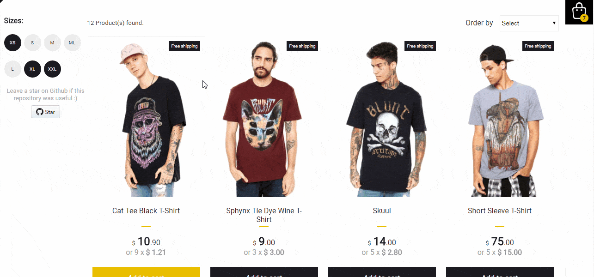

## 🛍️ Simple ecommerce cart application [](https://circleci.com/gh/jeffersonRibeiro/react-shopping-cart)
[](#contributors)

<p align="center">

  
</p>

## Basic Overview - [Live Demo](https://react-shopping-cart-67954.firebaseapp.com/)

This simple shopping cart prototype shows how React components and Redux can be used to build a
friendly user experience with instant visual updates and scaleable code in ecommerce applications.

#### Features

- Add and remove products from the floating cart
- Sort products by highest to lowest and lowest to highest price
- Filter products by available sizes
- Products persist in floating cart after page reloads
- Unit tests, integration tests and e2e testing
- Responsive design

## Getting started

Try playing with the code on CodeSandbox :)

[](https://codesandbox.io/s/74rykw70qq)

## Build/Run

#### Requirements

- Node.js
- NPM

```javascript

/* First, Install the needed packages */
npm install

/* Then start both Node and React */
npm start

/* To run the tests */
npm run test

/* Running e2e tests */
npm run wdio


```

## About tests

- Unit tests
  - All components have at least a basic smoke test
- Integration tests
  - Fetch product and add to cart properly
- e2e
  - Webdriverio - Add and remove product from cart

### Copyright and license

The MIT License (MIT). Please see License File for more information.

<br/>
<br/>

<p align="center"></p>
<p align="center">
<sub>A little project by <a href="http://www.jeffersonribeiro.com/">Jefferson Ribeiro</a></sub>
</p>

## Contributors

Thanks goes to these wonderful people ([emoji key](https://allcontributors.org/docs/en/emoji-key)):

<!-- ALL-CONTRIBUTORS-LIST:START - Do not remove or modify this section -->
<!-- prettier-ignore -->
<table>
  <tr>
    <td align="center"><a href="https://github.com/Syed-Saad-Qamar"><br /><sub><b>Syed Saad Qamar</b></sub></a><br /><a href="https://github.com/jeffersonRibeiro/react-shopping-cart/commits?author=Syed-Saad-Qamar" title="Code">💻</a></td>
    <td align="center"><a href="https://github.com/ksakiyama"><br /><sub><b>ksakiyama</b></sub></a><br /><a href="https://github.com/jeffersonRibeiro/react-shopping-cart/commits?author=ksakiyama" title="Code">💻</a></td>
    <td align="center"><a href="https://github.com/rithikachowta08"><br /><sub><b>Rithika Chowta</b></sub></a><br /><a href="https://github.com/jeffersonRibeiro/react-shopping-cart/commits?author=rithikachowta08" title="Code">💻</a></td>
    <td align="center"><a href="https://github.com/criesbeck"><br /><sub><b>Chris Riesbeck</b></sub></a><br /><a href="#ideas-criesbeck" title="Ideas, Planning, & Feedback">🤔</a> <a href="#tutorial-criesbeck" title="Tutorials">✅</a> <a href="#content-criesbeck" title="Content">🖋</a> <a href="#review-criesbeck" title="Reviewed Pull Requests">👀</a> <a href="https://github.com/jeffersonRibeiro/react-shopping-cart/issues?q=author%3Acriesbeck" title="Bug reports">🐛</a></td>
    <td align="center"><a href="https://www.linkedin.com/in/hay-tran-ab6421165/"><br /><sub><b>Hay Tran</b></sub></a><br /><a href="https://github.com/jeffersonRibeiro/react-shopping-cart/commits?author=HayTran94" title="Code">💻</a> <a href="#design-HayTran94" title="Design">🎨</a></td>
  </tr>
</table>

<!-- ALL-CONTRIBUTORS-LIST:END -->

This project follows the [all-contributors](https://github.com/all-contributors/all-contributors) specification. Contributions of any kind welcome!
