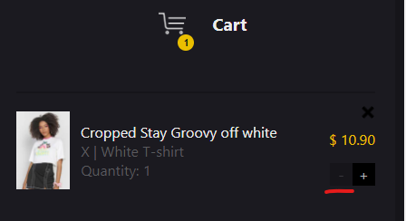

### Bug Report

**Issue:**
On the Checkout Page, clicking the '-' (minus) icon to decrease the quantity of a product in the basket doesn't update the quantity when the product count reaches one.

**Steps to Reproduce:**
1. Navigate to the checkout page.
2. Confirm there is a product with a quantity of 1 in the basket.
3. Locate the '-' (minus) icon next to the product quantity and click it.

**Expected Behavior:**
The product quantity in the basket should update to 0, and the total amount should be updated accordingly. When the quantity reaches zero, the product should be removed from the basket.

**Actual Behavior:**
The product quantity does not decrease and remains unchanged (1). The product is not removed from the basket.

**Screenshots:**

**Environment:**
- Environment: Test1
- Browser: Chrome
- Operating System: Windows 11

### Additional Information:

**Impact:**
This issue affects the user experience when using the checkout process, as users may not be able to effectively adjust the quantity of products in their basket.
However, there is a workaround and the product can be removed by clicking on the x icon above the product.

### Priority: Medium
The priority has been determined as Medium due to the workaround availability.